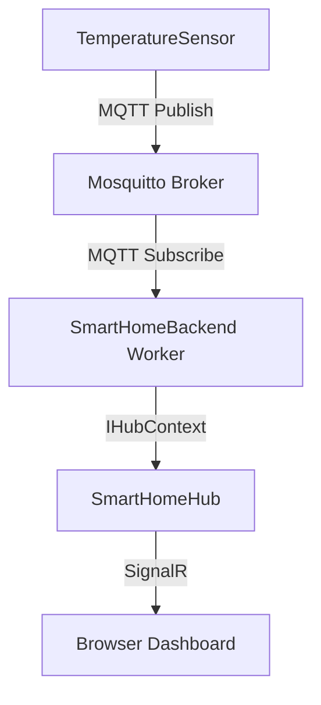

# SmartHomeMqtt

A practical **IoT communication project** built with **.NET, MQTT, Mosquitto, and SignalR** to demonstrate real-time communication between a simulated smart-home device and a browser dashboard.

> Built as a hands-on learning project to understand how MQTT-based device communication can be integrated with an ASP.NET Core backend and exposed to connected clients through SignalR.

---

## 🚀 Project Overview

The project simulates a smart-home temperature sensor.

The sensor publishes temperature readings through **MQTT** to a local **Mosquitto broker**.  
An ASP.NET Core background worker subscribes to the MQTT topic, receives the sensor messages, and forwards them to connected browser clients using **SignalR**.

The current communication flow is:

```text
┌─────────────────────┐
│  TemperatureSensor  │
│   .NET Console App  │
└──────────┬──────────┘
           │
           │ MQTT Publish
           │
           ▼
┌─────────────────────┐
│      Mosquitto      │
│    MQTT Broker      │
└──────────┬──────────┘
           │
           │ MQTT Subscribe
           │
           ▼
┌──────────────────────────────┐
│      SmartHomeBackend        │
│       ASP.NET Core           │
│                              │
│  BackgroundService (Worker)  │
└──────────┬───────────────────┘
           │
           │ IHubContext
           │
           ▼
┌──────────────────────────────┐
│       SmartHomeHub           │
│          SignalR             │
└──────────┬───────────────────┘
           │
           │ Real-time message
           │
           ▼
┌──────────────────────────────┐
│       Browser Dashboard      │
│          index.html          │
└──────────────────────────────┘
```

---

## ✨ Current Features

- **MQTT publisher** using a .NET console application
- **Mosquitto MQTT broker** running locally
- **MQTT subscriber** implemented with an ASP.NET Core `BackgroundService`
- Temperature messages published every **5 seconds**
- Topic-based MQTT communication
- Real-time browser updates using **SignalR**
- Automatic SignalR client reconnection
- Simple smart-home dashboard
- End-to-end MQTT → .NET → SignalR → Browser communication
- Git/GitHub version control

---

## 🧱 Technologies Used

| Technology | Purpose |
|---|---|
| **C# / .NET** | Application development |
| **ASP.NET Core** | Backend and web server |
| **MQTT** | IoT messaging protocol |
| **MQTTnet** | MQTT client library for .NET |
| **Mosquitto** | MQTT broker |
| **SignalR** | Real-time communication with browser clients |
| **HTML / CSS / JavaScript** | Smart-home dashboard |
| **Git / GitHub** | Version control |

---

# 🏗️ Architecture

## 1. High-Level Architecture



---

## 2. MQTT Communication

The simulated sensor publishes a temperature value to:

```text
home/room1/temperature
```

Example:

```text
Topic:
home/room1/temperature

Payload:
28
```

The communication model is:

```text
Publisher
    │
    ▼
MQTT Broker
    │
    ▼
Subscriber
```

### MQTT Roles in this Project

| Component | Role |
|---|---|
| `TemperatureSensor` | Publisher |
| `Mosquitto` | Broker |
| `SmartHomeBackend Worker` | Subscriber |

---

## 3. MQTT Topic Flow

The sensor publishes:

```text
home/room1/temperature
```

The backend subscribes to the same topic:

```text
home/room1/temperature
```

The message is then received by the MQTT callback in the worker.

```text
TemperatureSensor
        │
        │ Publish
        ▼
home/room1/temperature
        │
        ▼
Mosquitto
        │
        │ Subscribe
        ▼
SmartHomeBackend
```

---

# 🔄 End-to-End Message Flow

## Step-by-Step Flow

### Step 1 — Generate Temperature

The `TemperatureSensor` application generates a random temperature value.

Example:

```text
32°C
```

### Step 2 — Publish Through MQTT

The sensor creates an MQTT message:

```text
Topic   → home/room1/temperature
Payload → 32
```

and publishes it to Mosquitto.

### Step 3 — Mosquitto Routes the Message

Mosquitto receives the MQTT message and routes it to subscribers interested in:

```text
home/room1/temperature
```

### Step 4 — Backend Receives the Message

`SmartHomeBackend` runs a `BackgroundService` called `Worker`.

The worker connects to the MQTT broker and subscribes to:

```text
home/room1/temperature
```

When a message arrives, the MQTT event handler extracts:

```text
Topic
Message
```

### Step 5 — Forward to SignalR

The worker uses:

```csharp
IHubContext<SmartHomeHub>
```

to publish the received temperature to connected SignalR clients.

The backend sends:

```csharp
await _hubContext.Clients.All.SendAsync(
    "ReceiveTemperature",
    topic,
    message);
```

### Step 6 — Browser Receives the Update

The JavaScript SignalR client listens for:

```text
ReceiveTemperature
```

and receives:

```text
(topic, message)
```

The dashboard then updates the displayed temperature without requiring a page refresh.

---

# 🔌 SignalR Architecture

SignalR provides the real-time communication layer between the ASP.NET Core application and connected browser clients.

The hub endpoint is:

```text
/smart-home
```

The hub is:

```csharp
public class SmartHomeHub : Hub
{
}
```

The browser creates a SignalR connection to:

```javascript
.withUrl("/smart-home")
```

### Current SignalR Flow

```text
ASP.NET Core Backend
        │
        ▼
 SmartHomeHub
        │
        ▼
 SignalR Connection
        │
        ▼
 Browser Client
```

---

# 🧩 Main Components

## TemperatureSensor

Location:

```text
TemperatureSensor/Program.cs
```

Responsibilities:

- Connect to Mosquitto
- Generate simulated temperature readings
- Publish MQTT messages
- Publish every 5 seconds

Example:

```csharp
var message = new MqttApplicationMessageBuilder()
    .WithTopic("home/room1/temperature")
    .WithPayload(temperature.ToString())
    .Build();

await mqttClient.PublishAsync(message);
```

---

## Mosquitto

Mosquitto acts as the MQTT broker.

Default MQTT endpoint used by the project:

```text
localhost:1883
```

The broker is responsible for receiving published MQTT messages and delivering them to subscribers.

---

## SmartHomeBackend

Location:

```text
SmartHomeBackend/
```

ASP.NET Core backend responsible for:

- Running the MQTT background worker
- Hosting the SignalR hub
- Serving the browser dashboard
- Connecting MQTT messages with SignalR clients

---

## Worker

Location:

```text
SmartHomeBackend/Worker.cs
```

The worker inherits from:

```csharp
BackgroundService
```

Its responsibilities are:

```text
Connect to MQTT
      ↓
Subscribe to topic
      ↓
Receive MQTT messages
      ↓
Log the message
      ↓
Forward through SignalR
```

The worker receives:

```csharp
IHubContext<SmartHomeHub>
```

through dependency injection.

This allows a background service to communicate with connected SignalR clients without directly owning the SignalR hub connection.

---

## SmartHomeHub

Location:

```text
SmartHomeBackend/SmartHomeHub.cs
```

Current hub:

```csharp
public class SmartHomeHub : Hub
{
    public async Task SendMessage(string message)
    {
        await Clients.All.SendAsync("ReceiveMessage", message);
    }
}
```

The project currently uses the hub endpoint primarily as the SignalR communication endpoint, while the MQTT worker uses `IHubContext<SmartHomeHub>` to push sensor updates to clients.

---

## Browser Dashboard

Location:

```text
SmartHomeBackend/wwwroot/index.html
```

The dashboard:

- Connects to SignalR
- Displays connection status
- Receives temperature events
- Updates the displayed temperature in real time
- Shows the MQTT topic and received value

Current client event:

```text
ReceiveTemperature
```

---

# 📡 MQTT Concepts Demonstrated

## Publisher

The temperature sensor is the MQTT publisher:

```text
TemperatureSensor
        ↓
     Publish
```

## Broker

Mosquitto is the MQTT broker:

```text
Publisher → Mosquitto → Subscriber
```

## Subscriber

The ASP.NET Core worker subscribes to:

```text
home/room1/temperature
```

## Topic

Current topic:

```text
home/room1/temperature
```

Topic hierarchy makes it possible to organize devices and data logically.

Example structure:

```text
home
 └── room1
      └── temperature
```

## Payload

The payload is the actual value sent through the topic.

Example:

```text
32
```

---

# 🔀 MQTT vs SignalR in This Project

The project intentionally uses both technologies for different responsibilities.

| Technology | Main Responsibility |
|---|---|
| **MQTT** | Communication between IoT/device-style components |
| **Mosquitto** | MQTT message broker |
| **SignalR** | Real-time communication with browser clients |
| **ASP.NET Core Worker** | Bridge between MQTT and SignalR |

The result is:

```text
IoT Messaging
     │
     │ MQTT
     ▼
.NET Backend
     │
     │ SignalR
     ▼
Real-Time UI
```

---

# 🧠 Why `BackgroundService`?

The MQTT subscriber needs to keep running in the background and continuously listen for incoming messages.

For that reason, the backend uses:

```csharp
public class Worker : BackgroundService
```

and registers it with:

```csharp
builder.Services.AddHostedService<Worker>();
```

This allows the MQTT listener to start with the ASP.NET Core application and remain active while the application is running.

---

# 🌐 HTTP vs MQTT vs SignalR

This project combines multiple communication models.

### HTTP

Used by the ASP.NET Core web application and browser for normal web communication.

```text
Client
  ↓ Request
Server
  ↓ Response
Client
```

### MQTT

Used for device/message communication.

```text
Publisher
  ↓
Broker
  ↓
Subscriber
```

### SignalR

Used for persistent real-time communication between the backend and connected browsers.

```text
Server
  ⇄
Connected Clients
```

---

# ▶️ Getting Started

## Prerequisites

- .NET SDK
- Mosquitto MQTT Broker
- MQTTnet NuGet package
- Git

---

## 1. Clone the Repository

```bash
git clone https://github.com/Khaled-Elhanan/SmartHomeMqtt.git
cd SmartHomeMqtt
```

---

## 2. Start Mosquitto

Make sure the Mosquitto MQTT broker is running on:

```text
localhost:1883
```

On Windows, Mosquitto may be installed as a Windows service.

Verify the service:

```powershell
Get-Service mosquitto
```

Expected state:

```text
Running
```

---

## 3. Run the Backend

From the solution directory:

```powershell
dotnet run --project SmartHomeBackend
```

The backend hosts:

```text
http://localhost:5000
```

and the SignalR hub is available at:

```text
/smart-home
```

---

## 4. Run the Temperature Sensor

Open another terminal:

```powershell
dotnet run --project TemperatureSensor
```

The sensor will start publishing temperature readings every 5 seconds.

Example output:

```text
Connecting to MQTT Broker...
Connected!
Published temperature: 28°C
Published temperature: 31°C
Published temperature: 24°C
```

---

## 5. Open the Dashboard

Open:

```text
http://localhost:5000/
```

The dashboard should show:

```text
🟢 Connected to SignalR
```

and display the incoming temperature values.

---

# 🧪 Example Runtime Flow

```text
TemperatureSensor
        │
        │  Publish:
        │  home/room1/temperature = 32
        ▼
    Mosquitto
        │
        │  Deliver to subscriber
        ▼
SmartHomeBackend Worker
        │
        │  IHubContext
        ▼
   SmartHomeHub
        │
        │  ReceiveTemperature
        ▼
 Browser Dashboard
        │
        ▼
     32°C
```

---

# 🛠️ Project Structure

```text
SmartHomeMqtt/
│
├── SmartHomeBackend/
│   ├── Program.cs
│   ├── Worker.cs
│   ├── SmartHomeHub.cs
│   ├── SmartHomeBackend.csproj
│   ├── appsettings.json
│   ├── appsettings.Development.json
│   ├── Properties/
│   │   └── launchSettings.json
│   └── wwwroot/
│       └── index.html
│
├── TemperatureSensor/
│   ├── Program.cs
│   └── TemperatureSensor.csproj
│
├── SmartHomeMqtt.sln
├── global.json
└── .gitignore
```

---

# 🔐 Current Scope and Limitations

This repository currently focuses on the **core MQTT + SignalR integration**.

The current implementation is intentionally simple and is designed to demonstrate the communication flow.

The project does **not yet implement** advanced production concerns such as:

- MQTT authentication/TLS
- Advanced QoS scenarios
- Retained messages
- Last Will and Testament
- Persistent device state
- Database storage
- User authentication/authorization
- Multi-room device management
- Browser-to-device MQTT commands

These are natural areas for future development as the project evolves.

---

# 🚧 Future Improvements

Planned extensions can include:

```text
Browser
   ↓ SignalR
Backend
   ↓ MQTT Publish
Device
```

along with:

- Multiple simulated devices
- Temperature + humidity sensors
- Smart-light control
- MQTT QoS demonstrations
- Retained messages
- Last Will and Testament
- SignalR Groups
- Multiple browser clients
- Device online/offline status
- MQTT authentication and TLS
- Persistent sensor history
- Database integration

---

# 📚 Learning Goals

This project was built to understand:

### MQTT

- Publisher / Broker / Subscriber
- Topics
- Payloads
- Publish / Subscribe
- Topic hierarchy
- Wildcards
- MQTT client integration in .NET

### SignalR

- Hubs
- Connections
- Server-to-client communication
- `Clients.All`
- `IHubContext`
- Real-time browser updates
- Automatic reconnection

### ASP.NET Core

- `BackgroundService`
- Dependency Injection
- Hosted services
- Middleware/application pipeline
- Static files
- Configuration
- Logging

---

# 🎯 Current Architecture Summary

The complete system can be summarized as:

```text
┌──────────────────┐
│  Temperature     │
│     Sensor       │
└────────┬─────────┘
         │
         │ MQTT
         ▼
┌──────────────────┐
│    Mosquitto     │
│   MQTT Broker    │
└────────┬─────────┘
         │
         │ MQTT
         ▼
┌──────────────────┐
│  .NET Worker     │
│ BackgroundService│
└────────┬─────────┘
         │
         │ IHubContext
         ▼
┌──────────────────┐
│   SignalR Hub    │
└────────┬─────────┘
         │
         │ Real-time
         ▼
┌──────────────────┐
│ Browser Dashboard│
└──────────────────┘
```

---

# 👨‍💻 Author

**Khaled Abd-Elhanan**

Backend developer focused on learning and building real-world systems with **.NET, IoT communication, MQTT, and real-time technologies**.

GitHub:

**https://github.com/Khaled-Elhanan**

---

## 📄 License

This project is currently intended as a learning and portfolio project.
